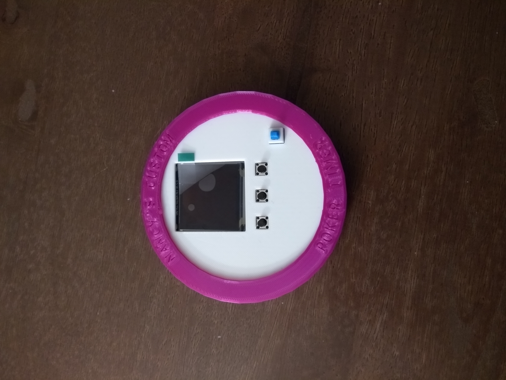
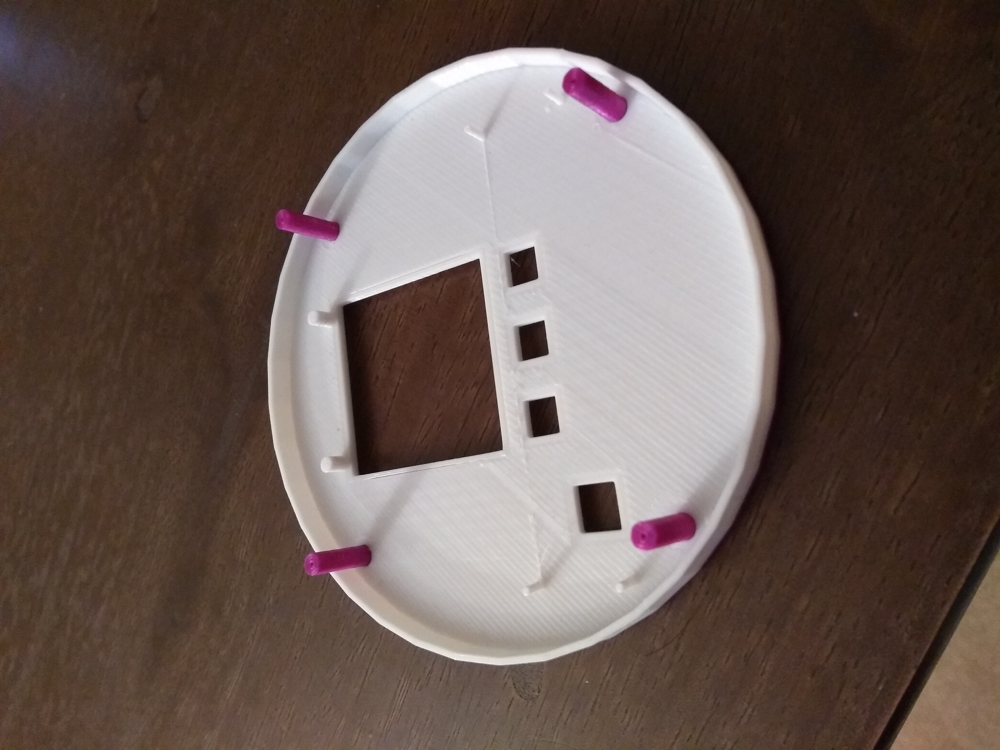
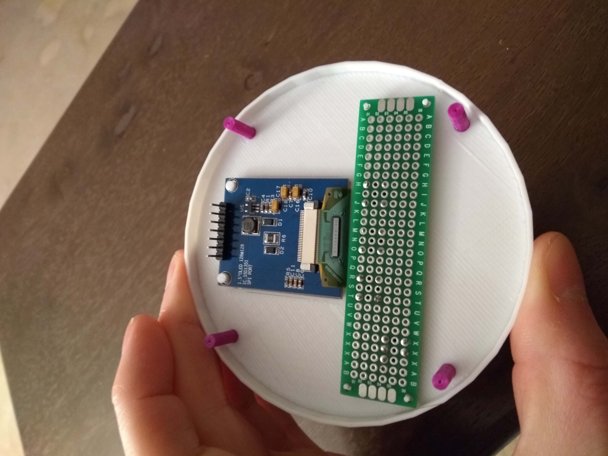
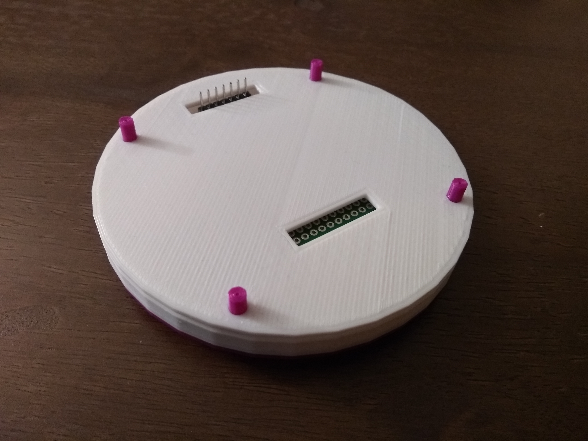
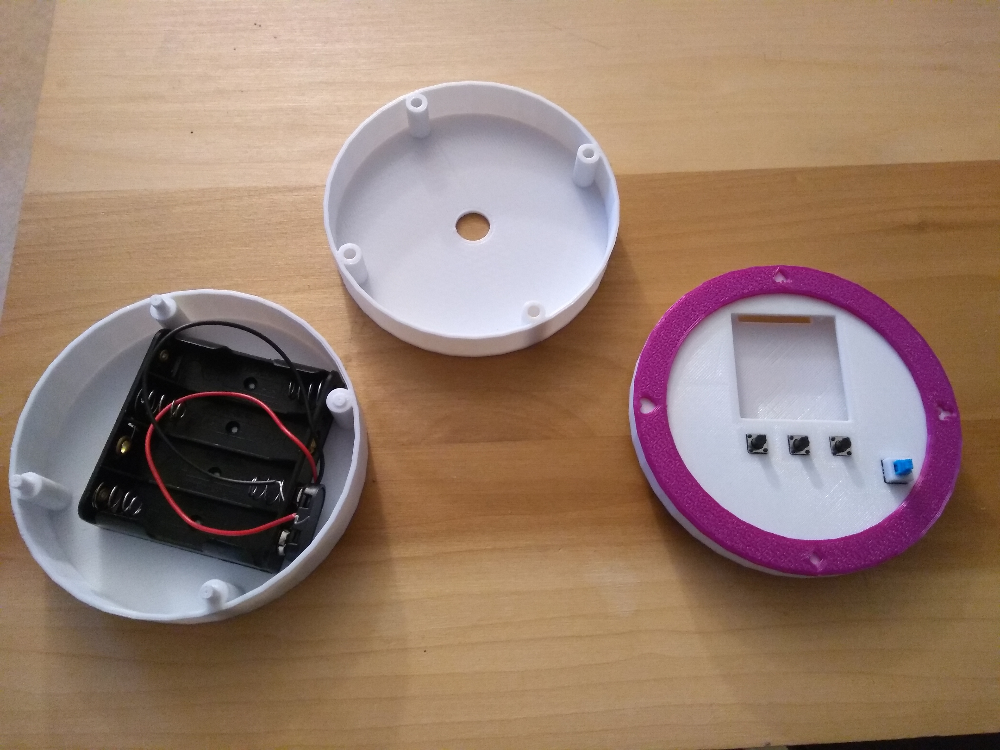
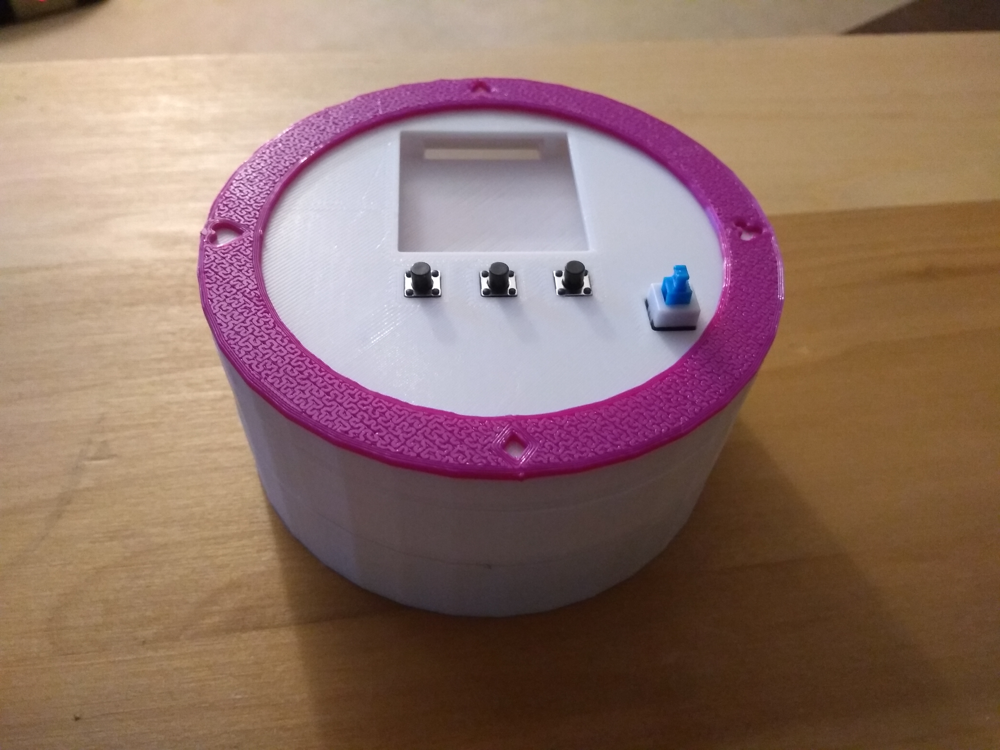
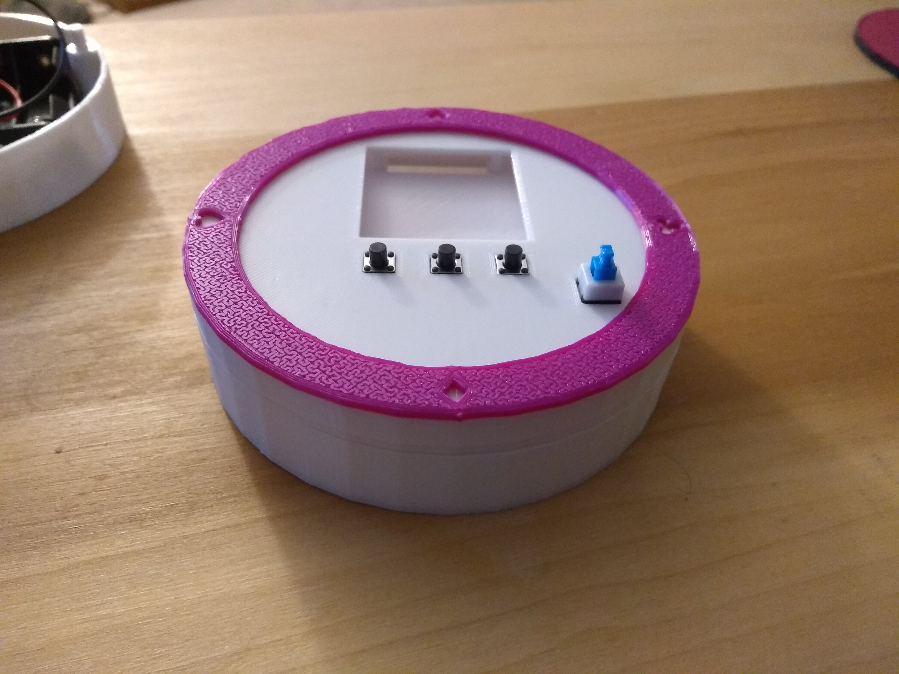
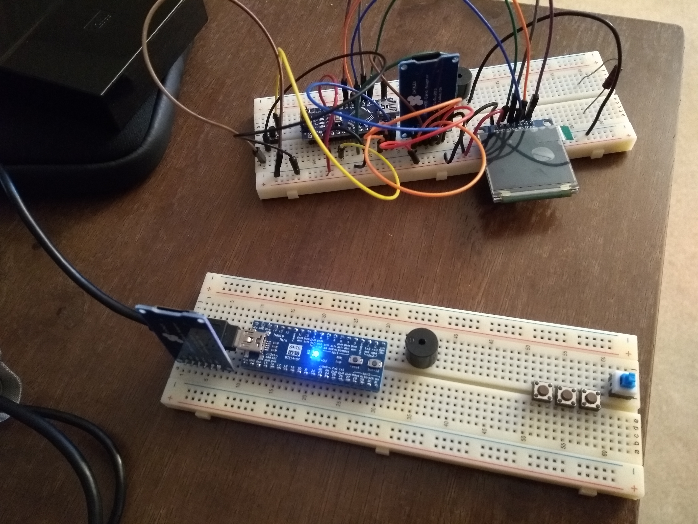

A little standalone poker blind timer project.

The basic idea is based on an Arduino mini/pro micro/nano (or perhaps a Teensy, or a Maple
Mini), battery powered (4x AA or AAA), includes an [SD
card](https://www.amazon.com/gp/product/B06XRD9LH5/) based configuration, an
[OLED](https://www.amazon.com/gp/product/B01HHPOD44/) screen to show the time
left in the round and the blind values, a [piezo
buzzer](https://www.amazon.com/gp/product/B0727VHH67/) to signal the round
changes, some buttons to control it (start/pause, prev round, next round), and
a 3D printed custom case designed using
[OpenSCAD](https://github.com/openscad/openscad/) and
[text_on_OpenSCAD](https://github.com/brodykenrick/text_on_OpenSCAD).

Status as of 20180309

Here's about what the OpenSCAD design looks like (using "show off" setting in the script):

and I've gone through a few changes along the way...the initial version of the top parts looked like this:

Which wasn't bad, but the text was difficult to get to look right, so I went
with suits instead (which still have their issues but overall look better I
think).  Here's what it, and the 2 remaining pieces ended up as (currently):

And all put together it looks like:

But it's looking a little...thick.  So I might just go without the battery
compartment, and switch to AAA batteries which should fit in the electronics
compartment w/ the electronics:

And speaking of the electronics, here's what the prototype version is looking like:

The top one that is wired up is based on an Arduino Nano clone, and I think
I'm hitting some issues that may be related to eating up nearly all of RAM
(uploading the sketch in progress complains that it is ~80% full due to
globals leaving only a little for runtime) while running, so I've decided to
switch to a Maple Mini clone (lower breadboard not wired up yet), giving me a
lot more RAM and Flash to work with, as well as a faster processor and a 2nd
HW I2C peripheral (which I hope will help with the I2C graphics updates).

I'll upload the sketch as I make more progress on it...

And after that's ready, I may revisit the design of the base.  The peg & hole
method is okay, but has issues (and I busted off one pin because of them
accidentally) so I'm thinking of trying an alternate connection approach (like
screw threads or a bayonet type connector).
