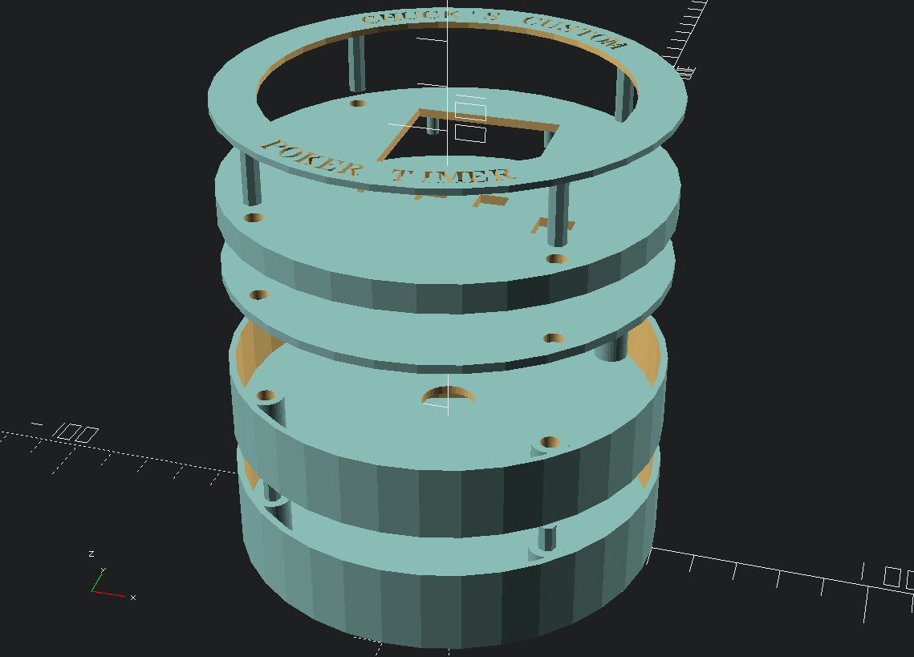

A little standalone poker blind timer project.

Based on an Arduino mini/pro micro/nano (or perhaps a Teensy, or a Maple
Mini), battery powered (4x AA or AAA), includes an [SD
card](https://www.amazon.com/gp/product/B06XRD9LH5/) based configuration, an
[OLED](https://www.amazon.com/gp/product/B01HHPOD44/) screen to show the time
left in the round and the blind values, a [piezo
buzzer](https://www.amazon.com/gp/product/B0727VHH67/) to signal the round
changes, some buttons to control it (start/pause, prev round, next round), and
a 3D printed custom case designed using
[OpenSCAD](https://github.com/openscad/openscad/) and
[text_on_OpenSCAD](https://github.com/brodykenrick/text_on_OpenSCAD).

